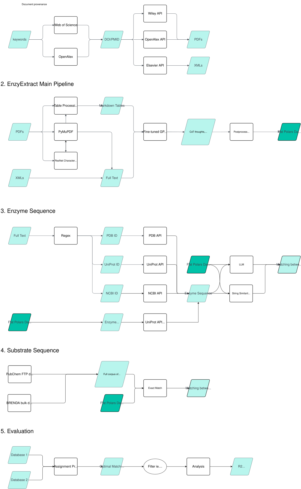

# EnzyExtract

Extract kinetics data from PDFs using LLMs.

# Installation

```bash
git clone https://github.com/ChemBioHTP/EnzyExtract
cd EnzyExtract
pip install -e .
```

Furthermore, create a `.env` file in the project root. Add your OpenAI API key:
```bash
OPENAI_API_KEY=...
```


# Quickstart

A preliminary tutorial is available on [Google Colab](https://colab.research.google.com/drive/1MwKSEZzLPNOseksRshbzkkFoO_cgJhva) or downloadable [here](experiments/example/EnzyExtract_Tutorial.ipynb).

# Database

For explanations of each header, see [docs/enzyextract_headers.md](docs/enzyextract_headers.md). 
**We recommend reading it** due to possible surprises.

## Initial Release

| Filename | kcat count | Location | Description |
| --- | --- | --- | --- |
| Original, crude | 242,115 | [data/export/TheData_kcat.parquet](data/export/TheData_kcat.parquet) | As originally described |
| Deduplicated, crude | 218,095 | [data/export/TheData_unpruned.parquet](data/export/TheData_unpruned.parquet) | With deduplication |
| EnzyExtractDB_176463 | 176,463 | [EnzyExtractDB/EnzyExtractDB_176463.parquet](EnzyExtractDB/EnzyExtractDB_176463.parquet) | Deduplicated and filtered |


The data is released as **CC BY-NC 4.0**. (NC is due to Elsevier and Wiley TDM APIs.)

The code is released as MIT.

# Usage

See `experiments/example/pipeline/ex_step*.py` for example scripts. The scripts should be run sequentially, though file paths may need to be adjusted.

Steps:
1. ex_step0_run_preprocessing.py:
    - Handles the preprocessing steps (ResNet, Table Extraction)
    - create a `.enzy` folder for simplified file management
2. ex_step1_run_tableboth.py
    - Given PDFs and preprocessed data, feed to LLMs using Batch API.
    - File locations should be automatically saved to `.enzy/llm_log.tsv`.
3. ex_step1b_run_pdf_binaries.py
    - **Alternative** to `step0` and `step1`: feed PDF binaries directly to Claude.
4. ex_step2_download.py
    - Small script to retrieve batches from Batch APIs.
5. ex_step3_llm_to_df.py
    - Convert the LLM output to parquet files.
6. ex_step5_generate_identifiers.py
    - **Optional**: Attach sequence identifiers (EC number, UniProt ID, PDB ID, SMILES, PubChem ID) to the data from `step3`.

## Evaluation

See `experiments/example/evaluation/ex_step*.py`.

1. ex_eval1_compare_dfs.py
    - Evaluate and benchmark LLM data against a trusted dataset.
2. ex_eval2_plot_dfs.py
    - Plot the data from `ex_eval1`.

## Accessions

Enzyme accession pipeline is a WIP. Please see [docs/pipeline/enzyme_accessions.md](docs/pipeline/enzyme_accessions.md).

For docs on getting substrate IDs, please see [docs/pipeline/substrate_accessions.md](docs/pipeline/substrate_accessions.md)


# Architecture



# Citation

If you find EnzyExtract useful, please cite it as below:

```bibtex
@article{wei2025finding,
  title={Finding the dark matter: Large language model-based enzyme kinetic data extractor and its validation},
  author={Wei, Galen and Ran, Xinchun and AI-Abssi, Runeem and Yang, Zhongyue},
  journal={Protein Science},
  volume={34},
  number={9},
  pages={e70251},
  year={2025},
  publisher={Wiley Online Library}
}
```